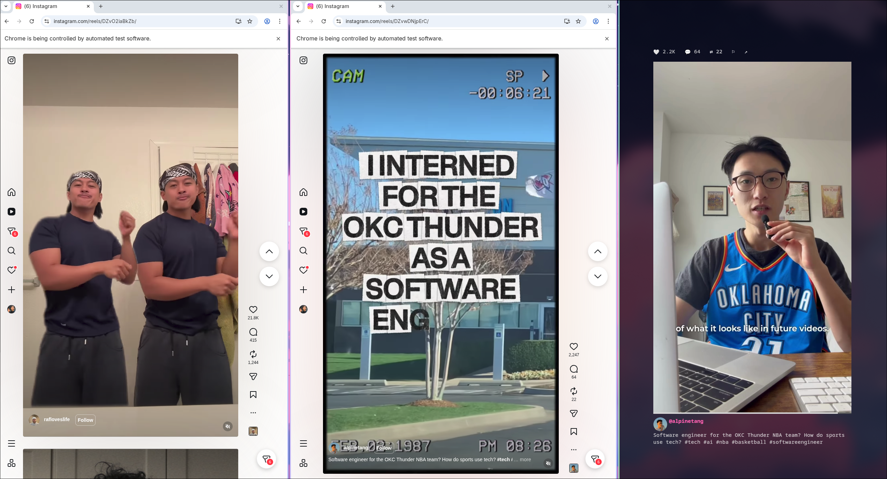
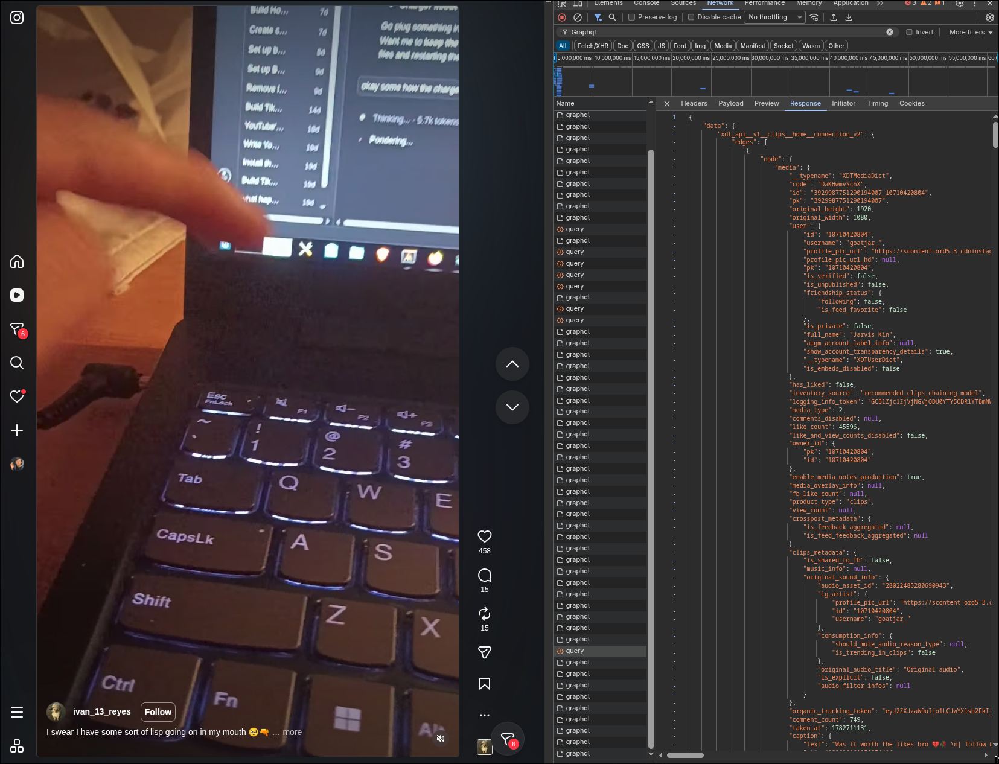

# Contributing to Reels

Thanks for your interest in contributing!

## Philosophy

Reels is an Instagram **reels** client, not a full Instagram client. Features outside that focus (group-chat messaging, browsing a user's profile, etc.) are unlikely to be accepted.

Two design principles worth knowing before you build something:

- **Browser automation first.** Driving a real browser both lowers the risk of Instagram flagging the account and keeps your Instagram algorithm in sync with your actual behavior (watch time, likes, and so on). A client that genuinely influences your feed is part of this project.
- **Private API endpoints, used sparingly.** Some features hit Instagram's private GraphQL API. It's convenient but riskier, and it needs ongoing maintenance since the `doc_id`s change whenever Instagram updates their frontend (see below).

Small bug fixes and features are always welcome. For a large change or refactor, **open an issue first** describing the problem and your intended approach.

  
  

## AI-assisted contributions

AI tooling is perfectly fine. However, review AI output unless it's a repetitive task backed by a dedicated skill.

## Development setup

Building from source is covered in the [README](README.md#building-from-source-for-developers) (Go 1.25+, FFmpeg 8+ dev libraries, `go build -o reels .`). FFmpeg 8+ is required because go-astiav only supports 8+; when it moves to a newer version, so do we.

- Run with `--headed` to show the browser window, which makes debugging much easier.
- `log.go` provides a logging helper. Keep logging **out of `main`**. Use it on feature branches while developing, then strip it before merging to keep consumer binaries clean.

### Project layout

- `backend/` - Instagram interaction, GraphQL interception, Storage, Config parsing. 
- `tui/` - Bubble Tea UI
- `player/` - AV playback (astiav, beep)
- `main.go` - Entry point

## Building & testing

Run `go vet ./...` and `gofmt` before opening a PR.

The build statically links FFmpeg into the binary. On a fork, push your changes and then
tag to trigger the build. Confirm all target binaries build successfully.

Testing is hard because there are so many ways to interact with Instagram, but `tests/`
takes a black-box approach. `test.py` builds the binary, runs it under Kitty, and drives Reels TUI by sending keystrokes and observing browser state. You'll need a logged-in account, Kitty, Chrome, and FFmpeg 8+. Coverage is minimal and contributions are welcome, as long as they keep treating the app as a black box.

## Commit & PR conventions

- Fork and open PRs against `main`.
- Use [Conventional Commits](https://www.conventionalcommits.org/) and squash related commits.
- I'll maintain the changelog, no need to touch it.
- Small fixes need only a brief description; large PRs need a detailed explanation of the problem and approach.
- Make sure the build produces all target binaries.

## Maintainer-only tasks

Releases and package distribution (AUR / Homebrew / npm submodules) are handled by the
maintainer. Contributors don't touch version tags, changelog release entries, or the
distribution submodules.

## ⚠️ Updating Instagram's GraphQL constants

Instagram periodically changes their frontend GraphQL API. When they do, some features that rely on hitting their private endpoints will stop working. The fix involves updating constants in the code, such as `doc_id`s, `fb_api_req_friendly_name` values, and the `x-ig-app-id` header.

This is automated with several Claude skills in [`skills/`](skills/). See [`skills/README.md`](skills/README.md).

## Reporting issues

Please include:

- OS and architecture
- Terminal emulator, and whether it supports the Kitty graphics protocol
- Reels version
- Steps to reproduce

Consumer binaries ship without logging, so there's usually no log to attach. If you built with logging enabled, include the relevant lines from `~/.local/state/reels/reels.log`.

## Contact

GitHub issues only.
