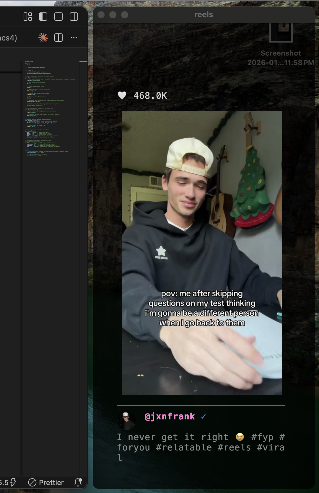
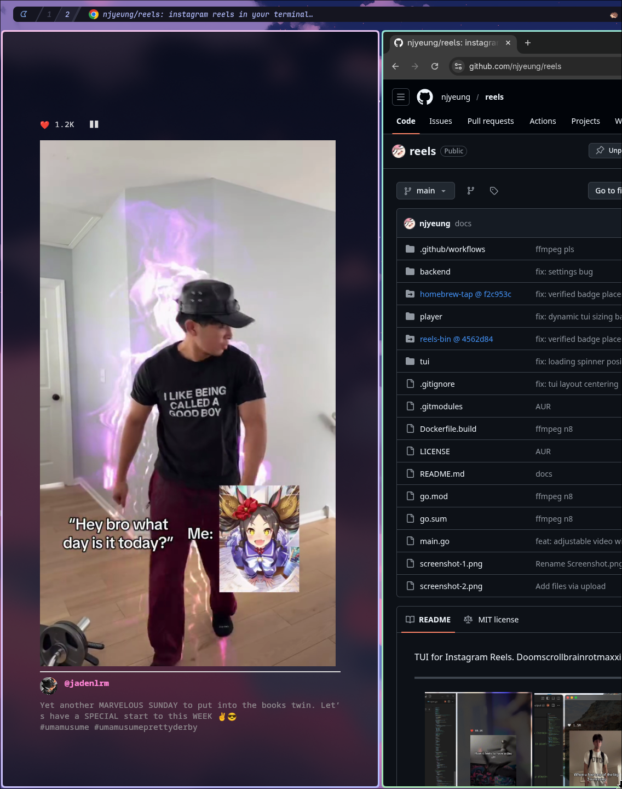

TUI for Instagram Reels. Doomscrollbrainrotmaxxing in the terminal.

---

<p align="center">
  
  
  
</p>

## Prerequisites

### Terminal
You need a terminal that supports the **Kitty graphics protocol**:
- [Kitty](https://sw.kovidgoyal.net/kitty/) (recommended)
- [WezTerm](https://wezfurlong.org/wezterm/)
- [Konsole](https://konsole.kde.org/) (experimental support)

### Browser
Chrome, Chromium, or Brave must be installed. The app uses headless browser automation to interact with Instagram.

## Usage

```bash
reels
```

### Flags
- `--headed` - Run browser in headed mode (visible browser window)
- `--login` - Open browser window to log in to Instagram

### Controls
- `j` / `↓` - Next reel
- `k` / `↑` - Previous reel
- `Space` - Pause/resume
- `l` - Like/unlike
- `e` - Toggle Navbar
- `c` - Toggle Comments
- `m` - Mute
- `-` - Shrink Video
- `=` - Enlarge Video
- `q` - Quit

## Installation

### Homebrew (macOS ARM64 / Linux x86_64)

```bash
brew tap njyeung/reels
brew install reels
reels
```

### AUR (Arch Linux x86_64)

```bash
sudo pacman -Syu ffmpeg # make sure you're on ffmpeg n8.0
yay -S reels-bin
reels
```

### Pre-built Binaries

Download the latest release from [GitHub Releases](https://github.com/njyeung/reels/releases):

| Platform | Binary |
|----------|--------|
| Linux (x86_64) | `reels-linux-amd64` |
| macOS (Apple Silicon) | `reels-darwin-arm64` |

**Note:** Pre-built binaries require FFmpeg 8+ to be installed on your system.

### Building from Source

Requires Go 1.25+ and FFmpeg 8+ development libraries.

```bash
git clone https://github.com/njyeung/reels.git
cd reels
go build -o reels .
```

## Settings

- **macOS**: `~/Library/Application Support/reels/reels.conf`
- **Linux**: `~/.config/reels/reels.conf`

```
# Default config (created on first run)

show_navbar = true
retina_scale = 2    # 2 on macOS, 1 on Linux by default
reel_width = 270  
reel_height = 480
```

## TODO

- Support for comments sections
- Sharing (to friends and copying reel link)
- Optimize performance (gpu decoding, shared memory w/ kitty instead of base64 encoding every frame)
- syncing bugs with browser 
