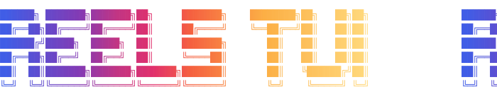

<p align="center">
  <a href="https://www.npmjs.com/package/@reels/tui"></a>
  <a href="https://aur.archlinux.org/packages/reels-bin"></a>
  <a href="https://github.com/njyeung/homebrew-tap"></a>
  <a href="https://github.com/njyeung/reels/releases/latest"></a>
</p>
<p align="center">
  <a href="https://github.com/njyeung/reels"></a>
  
  
  
  <a href="https://goreportcard.com/report/github.com/njyeung/reels"></a>
  
</p>

<p align="center">
  
</p>
<p align="center">
  
  
  
</p>
<p align="center">
  
</p>

---

## Prerequisites

### Terminal
You need a terminal that supports the **Kitty graphics protocol**:
- [Kitty](https://sw.kovidgoyal.net/kitty/) (most performant)
- [WezTerm](https://wezfurlong.org/wezterm/)
- [Konsole](https://konsole.kde.org/)

### Chrome (LINUX ARM64 ONLY)
Chrome is automatically downloaded on first run if no system Chrome/Chromium is found; No action is needed for most platforms. The exception is Linux ARM64, where Chrome For Testing isn't available yet ([coming Q2 2026!](https://blog.chromium.org/2026/03/bringing-chrome-to-arm64-linux-devices.html)). If you are on Linux ARM64, you'll need to install Chromium manually before running Reels.

## Usage

```bash
reels
```

### Flags
- `--headed` - Run browser in headed mode (visible browser window)
- `--login` - Open browser window to log in to Instagram

### Controls

| reels.conf bind | Default | Action |
|-----------------|---------|--------|
| `key_next` | `j` | Next reel (scrolls panels when open) |
| `key_previous` | `k` | Previous reel (scrolls panels when open) |
| `key_seek_backward` | `h` | Seek backward by 5 seconds |
| `key_seek_forward` | `l` | Seek forward by 5 seconds |
| `key_like` | `space` | Like/unlike |
| `key_share_select` | `space` | Select friend in share panel. Overrides any other bind while share panel is open |
| `key_pause` | `p` | Pause/resume current reel |
| `key_save` | `b` | Save/Unsave (bookmark) current reel |
| `key_navbar` | `e` | Toggle navbar, a condensed version of the help menu |
| `key_comments_open` | `c` | Open comments |
| `key_comments_close` | `C` | Close comments |
| `key_share_open` | `s` | Open share panel. Allows you to share reels with instagram's suggested top friends. |
| `key_share_close` | `S` | Close Share panel & sends to friends' DMs (if any are selected) |
| `key_copy_link` | `y` | Copy reel link to clipboard |
| `key_mute` | `m` | Mute current reel |
| `key_vol_up` | `]` | Volume up |
| `key_vol_down` | `[` | Volume down |
| `key_reel_size_inc` | `=` | Enlarge video |
| `key_reel_size_dec` | `-` | Shrink video |
| `key_help_open` | `?` | Help panel shows the current keybinds |
| `key_help_close`| `?` | Close help panel |
| `key_quit` | `q` | Quit |
| `key_quit` | `ctrl+c` | Quit |

All keybinds are configurable in `reels.conf`. Each action supports multiple binds. Open/close pairs (like `key_comments_open` and `key_comments_close`) can be bound to the same key to toggle.

## Installation

### npm (macOS ARM64 / Linux x86_64 & ARM64)

```bash
npm install -g @reels/tui
reels
```

### Homebrew (macOS ARM64 / Linux x86_64 & ARM64)

```bash
brew tap njyeung/tap
brew install reels
reels
```

### AUR (Arch Linux x86_64 & ARM64)

```bash
yay -S reels-bin
reels
```

### Pre-built Binaries

Download the latest release from [GitHub Releases](https://github.com/njyeung/reels/releases):

| Platform | Binary |
|----------|--------|
| Linux (x86_64) | `reels-linux-amd64` |
| Linux (ARM64) | `reels-linux-arm64` |
| macOS (Apple Silicon) | `reels-darwin-arm64` |

### Building from Source (For Developers)

Requires Go 1.25+ and FFmpeg 8+ development libraries.

Pre-built binaries ship with FFmpeg statically linked. For development, dynamically linking against a system FFmpeg makes building and iteration faster (simply `go build -o reels`). You can still build using docker, but I highly recommend installing the correct versions of FFmpeg following the directions below:

**macOS:** Requires `ffmpeg-full` from [Homebrew](https://brew.sh) (`brew install ffmpeg-full`), [MacPorts](https://ports.macports.org/port/ffmpeg/), or FFmpeg 8+ built from [source](https://github.com/ffmpeg/ffmpeg). The standard `brew install ffmpeg` is missing required framework link flags.

**Linux:** Requires FFmpeg 8+ development libraries from your package manager (e.g. `sudo pacman -S ffmpeg` on Arch, `sudo apt install ffmpeg` on Debian/Ubuntu). This usually works fine as long as your packages are updated.

```bash
# brew install ffmpeg-full      on macOS
# sudo apt install ffmpeg       on Linux
# ffmpeg -version               should be 8+
git clone https://github.com/njyeung/reels.git
cd reels
go build -o reels .
```

## File Paths

- Settings: `~/.config/reels/reels.conf`
- Cache: `~/.cache/reels/`
- Chrome Data: `~/.local/shared/reels/`

## Default settings

```
# Default config (created on first run)

show_navbar = true
retina_scale = 2    # auto detects 2 on macOS, 1 on Linux by default
reel_width = 270
reel_height = 480
reel_size_step = 30
volume = 1
gif_cell_height = 5
panel_shrink_steps = 4  # how many reel_size_steps to shrink when opening a panel

# Configurable keybinds (multiple binds per action supported)
key_next = j
key_previous = k
key_pause = p
key_mute = m
key_like = space
key_navbar = e
key_vol_up = ]
key_vol_down = [
key_reel_size_inc = =
key_reel_size_dec = -
key_copy_link = y
key_save = b
key_seek_forward = l
key_seek_backward = h
key_share_open = s
key_share_close = S
key_share_select = space
key_comments_open = c
key_comments_close = C
key_help_open = ?
key_help_close = ?
key_quit = q
key_quit = ctrl+c
```
