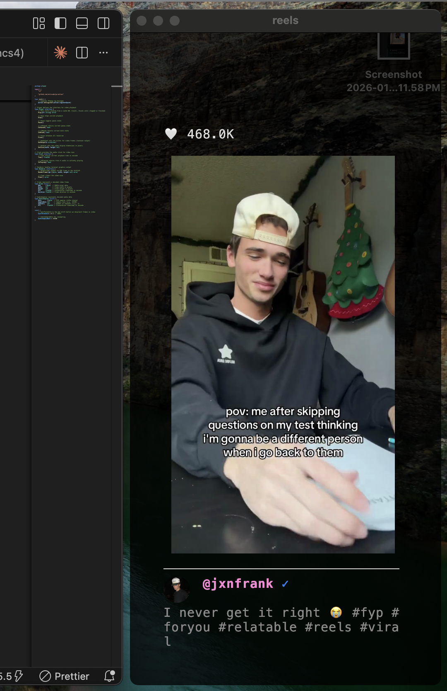
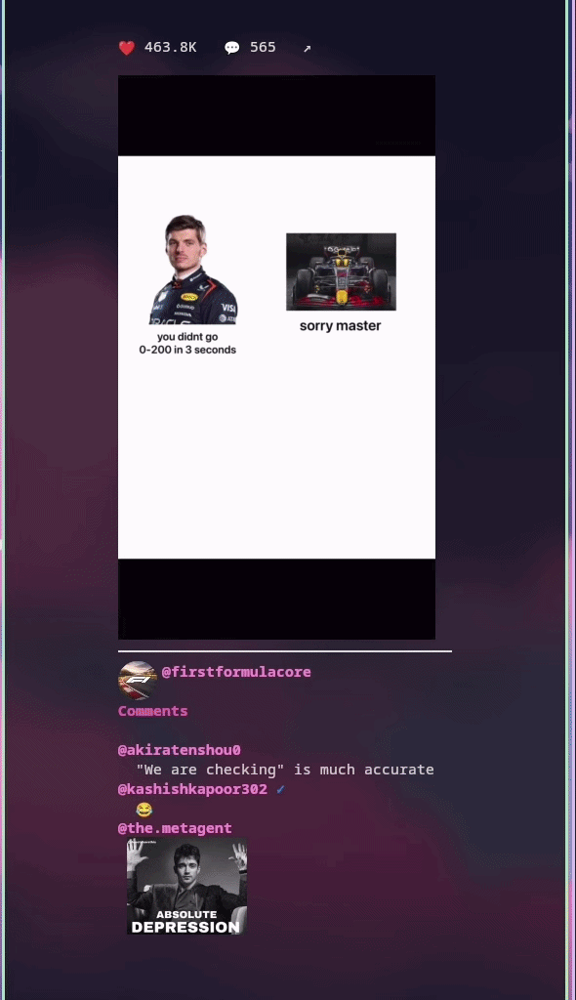
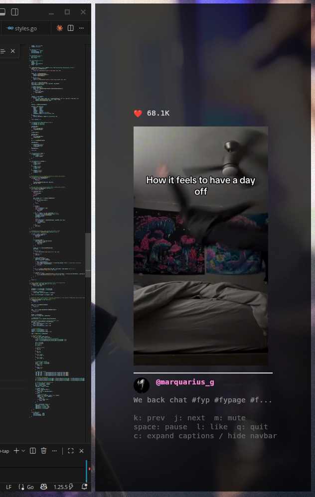

<p align="center">
  <a href="https://www.npmjs.com/package/@reels/tui"></a>
  <a href="https://aur.archlinux.org/packages/reels-bin"></a>
  <a href="https://github.com/njyeung/homebrew-tap"></a>
  <a href="https://github.com/njyeung/reels/releases/latest"></a>
</p>
<p align="center">
  <a href="https://github.com/njyeung/reels"></a>
  
  
  
  <a href="https://goreportcard.com/report/github.com/njyeung/reels"></a>
  
</p>

<p align="center">
  <pre align="center">    
██████╗ ███████╗███████╗██╗     ███████╗    ████████╗██╗   ██╗██╗
██╔══██╗██╔════╝██╔════╝██║     ██╔════╝    ╚══██╔══╝██║   ██║██║
██████╔╝█████╗  █████╗  ██║     ███████╗       ██║   ██║   ██║██║
██╔══██╗██╔══╝  ██╔══╝  ██║     ╚════██║       ██║   ██║   ██║██║
██║  ██║███████╗███████╗███████╗███████║       ██║   ╚██████╔╝██║
╚═╝  ╚═╝╚══════╝╚══════╝╚══════╝╚══════╝       ╚═╝    ╚═════╝ ╚═╝
  </pre>
</p>
<p align="center">
  <em>Doomscrollbrainrotmaxxing in the terminal.</em>
</p>

<p align="center">
  
  
  
</p>

---

## Prerequisites

### Terminal
You need a terminal that supports the **Kitty graphics protocol**:
- [Kitty](https://sw.kovidgoyal.net/kitty/) (recommended — most performant)
- [WezTerm](https://wezfurlong.org/wezterm/)
- [Konsole](https://konsole.kde.org/)

### Browser
Chrome, Chromium, or Brave must be installed. The app uses headless browser automation to interact with Instagram.

### FFmpeg
FFmpeg 8+ must be installed on your system. The Homebrew install method handles this automatically. For other install methods, see the FFmpeg notes under each section below.

## Usage

```bash
reels
```

### Flags
- `--headed` - Run browser in headed mode (visible browser window)
- `--login` - Open browser window to log in to Instagram

### Controls
- `j` - Next reel (scroll comments when open)
- `k` - Previous reel (scroll comments when open)
- `Space` - Pause/resume
- `l` - Like/unlike
- `e` - Toggle Navbar
- `c` - Toggle Comments
- `m` - Mute
- `]` - Volume up
- `[` - Volume down
- `s` - Share reel via DM
- `y` - Copy reel link to clipboard
- `=` - Enlarge Video
- `-` - Shrink Video
- `?` - Help
- `q` - Quit

All keybinds are configurable in `reels.conf`. Each action supports multiple binds.

## Installation

### npm (macOS ARM64 / Linux x86_64)

**macOS** *requires [Homebrew](https://brew.sh)*:
```bash
brew install ffmpeg-full
npm install -g @reels/tui
reels
```

**Linux:**
```bash
# sudo pacman -S ffmpeg        # Arch
# sudo apt install ffmpeg      # Debian/Ubuntu
npm install -g @reels/tui
reels
```

### Homebrew (macOS ARM64 / Linux x86_64)

```bash
brew tap njyeung/tap
brew install reels
reels
```

### AUR (Arch Linux x86_64)

```bash
sudo pacman -Syu ffmpeg # make sure you're on ffmpeg n8.0
yay -S reels-bin
reels
```

### Pre-built Binaries

Download the latest release from [GitHub Releases](https://github.com/njyeung/reels/releases):

| Platform | Binary |
|----------|--------|
| Linux (x86_64) | `reels-linux-amd64` |
| macOS (Apple Silicon) | `reels-darwin-arm64` |

**macOS:** Requires `ffmpeg-full` from Homebrew — `brew install ffmpeg-full`

**Linux:** Requires FFmpeg 8+ (e.g. `sudo pacman -S ffmpeg` on Arch, `sudo apt install ffmpeg` on Debian/Ubuntu)

### Building from Source

Requires Go 1.25+ and FFmpeg 8+ development libraries.

```bash
git clone https://github.com/njyeung/reels.git
cd reels
go build -o reels .
```

## File Paths

- Settings: `~/.config/reels/reels.conf`
- Cache: `~/.cache/reels/`
- Chrome Data: `~/.local/shared/reels/`

## Default settings

```
# Default config (created on first run)

show_navbar = true
retina_scale = 2    # auto detects 2 on macOS, 1 on Linux by default
reel_width = 270
reel_height = 480
reel_size_step = 30
volume = 1
gif_cell_height = 5
panel_shrink_steps = 4  # how many reel_size_steps to shrink when opening a panel

# Configurable keybinds (multiple binds per action supported)
key_next = j
key_previous = k
key_pause = space
key_mute = m
key_like = l
key_comments = c
key_navbar = e
key_vol_up = ]
key_vol_down = [
key_reel_size_inc = =
key_reel_size_dec = -
key_share = s
key_copy_link = y
key_quit = q
key_quit = ctrl+c
```
