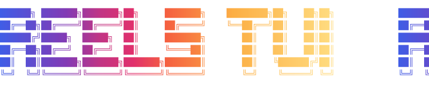

<p align="center">
  <a href="https://www.npmjs.com/package/@reels/tui"></a>
  <a href="https://aur.archlinux.org/packages/reels-bin"></a>
  <a href="https://github.com/njyeung/homebrew-tap"></a>
  <a href="https://github.com/njyeung/reels/releases/latest"></a>
</p>
<p align="center">
  <a href="https://github.com/njyeung/reels"></a>
  
  
  
  
</p>

<p align="center">
  
</p>
<p align="center">
  
</p>

<!-- SHOT 01 — hero. Placeholder until the shoot lands. -->
<p align="center">
  
</p>

---

Reels TUI brings the full Instagram Reels experience to your terminal. Scroll your feed, browse comments, interact with your friends, and more.

## Installation

### npm (macOS ARM64 / Linux x86_64 & ARM64)

```bash
npm install -g @reels/tui
reels
```

### Homebrew (macOS ARM64 / Linux x86_64 & ARM64)

```bash
brew tap njyeung/tap
brew install reels
reels
```

### AUR (Arch Linux x86_64 & ARM64)

```bash
yay -S reels-bin
reels
```

## Usage

```bash
reels
```

| Flag | Effect |
|------|--------|
| `--login` | Opens a visible browser to log in to Instagram. Reels won't drive the browser in this mode, which also makes it useful for debugging |
| `--headed` | Runs the browser visibly while Reels still controls it. Use this to diagnose sync failures |
| `--config` | Opens the keybind editor. Doesn't launch a browser |
| `--version` | Prints the version and exits |

## Terminal
You need a terminal that supports the **Kitty graphics protocol**:
- [Kitty](https://sw.kovidgoyal.net/kitty/) (recommended)
- [Ghostty](https://ghostty.org/) (recommended)
- [WezTerm](https://wezfurlong.org/wezterm/) (recommended)
- [iTerm2](https://iterm2.com/) (recommended)
- [st](https://st.suckless.org/) (recommended)
- [Konsole](https://konsole.kde.org/)
- [Warp](https://www.warp.dev/)
- [wayst](https://github.com/91861/wayst)

## Troubleshooting

<details>
<summary><b>"Syncing failed", or startup hangs before the feed appears</b></summary>

<br>

Nearly always means the saved session didn't stick, even if you clicked **Save Info**.

Relaunch with the browser visible:

```bash
reels --headed
```

If the window is sitting on an Instagram login screen, log in and click **Save Info** again.

</details>

<details>
<summary><b>My terminal shows no video at all</b></summary>

<br>

It is likely that your terminal does not properly support the **Kitty graphics protocol**. See [Terminal](#Terminal).

</details>

<details>
<summary><b>Linux ARM64: Chrome won't download</b></summary>

<br>

Chrome is automatically downloaded on first run if no system Chrome/Chromium is found; No action is needed for most platforms. The exception is Linux ARM64, where Chrome For Testing isn't available yet ([coming Q2 2026!](https://blog.chromium.org/2026/03/bringing-chrome-to-arm64-linux-devices.html)).

On Linux ARM64, install Chrome, Chromium, or Brave manually before running Reels.

</details>

<details>
<summary><b>Nothing works</b></summary>

<br>

Sometimes, the Chrome profile may be left in an unrecoverable state. Wipe the chrome-data and restart:

```bash
rm -rf ~/.local/share/reels/
reels
```

</details>

## Features

<!-- SHOTS 02-09 — placeholders until the shoot lands. -->

<table>
<tr>
<td width="50%">

**Scroll the feed**

`j` / `k` to move, or just use the scroll wheel.


</td>
<td width="50%">

**Seek within a reel**

`l` jumps forward 5 seconds, `h` goes back.


</td>
</tr>
<tr>
<td width="50%">

**Like, repost, save**

`space` to like, `r` to repost, `b` to bookmark. `y` copies the link.


</td>
<td width="50%">

**Comments**

`c` opens the panel, `C` closes it. Expand any comment to read its replies — the reel
keeps playing the whole time.


</td>
</tr>
<tr>
<td width="50%">

**Mouse support**

Click the heart to like. Click the reel to pause. Click the caption to toggle the
navbar.


</td>
<td width="50%">

**Share to DMs**

`s` opens your suggested friends, `space` selects, `S` sends and closes.


</td>
</tr>
<tr>
<td width="50%">

**Watch what friends sent you**

`d` opens your chats. Reels shared with you play with a blue border and your friend's
profile picture.


</td>
<td width="50%">

**React to their reels**

`x` opens the react panel. Reactions float over the reel as animated emoji.


</td>
</tr>
</table>

## Config

All keybinds are configurable. Each action supports multiple binds. Open/close pairs can be bound to the same key to toggle.

Edit them in the TUI:

```bash
reels --config
```

<!-- SHOT 10 — placeholder until the shoot lands. -->
<p align="center">
  
</p>

The config TUI is simply a wrapper for `~/.config/reels/reels.conf`, which can be edited by hand.

**See [CONFIG.md](CONFIG.md) for the full list of settings and their defaults.**

## File paths

| What | Where |
|------|-------|
| Settings | `~/.config/reels/reels.conf` |
| Cache | `~/.cache/reels/` |
| Browser data | `~/.local/share/reels/` |
| Logs | `~/.local/state/reels/reels.log` |


## Pre-built Binaries
Download the latest release from [GitHub Releases](https://github.com/njyeung/reels/releases):

| Platform | Binary |
|----------|--------|
| Linux (x86_64) | `reels-linux-amd64` |
| Linux (ARM64) | `reels-linux-arm64` |
| macOS (Apple Silicon) | `reels-darwin-arm64` |

## Building from source (For Developers)

Requires Go 1.25+ and FFmpeg 8+ development libraries.

Pre-built binaries ship with FFmpeg statically linked. For development, dynamically linking against a system FFmpeg makes building and iteration faster (simply `go build -o reels`). You can still build using docker, but I highly recommend installing the correct versions of FFmpeg following the directions below:

**macOS:** Requires `ffmpeg-full` from [Homebrew](https://brew.sh) (`brew install ffmpeg-full`), [MacPorts](https://ports.macports.org/port/ffmpeg/), or FFmpeg 8+ built from [source](https://github.com/ffmpeg/ffmpeg). The standard `brew install ffmpeg` is missing required framework link flags.

**Linux:** Requires FFmpeg 8+ development libraries from your package manager (e.g. `sudo pacman -S ffmpeg` on Arch, `sudo apt install ffmpeg` on Debian/Ubuntu). This usually works fine as long as your packages are updated.

```bash
# brew install ffmpeg-full      on macOS
# sudo apt install ffmpeg       on Linux
# ffmpeg -version               should be 8+
git clone https://github.com/njyeung/reels.git
cd reels
go build -o reels .
```

---

<!-- SHOT 11 — credibility strip. Reusing existing captures for now. -->
<p align="center">
  
  
  
</p>
<p align="center">
  <sub>Pop!_OS · macOS · Arch</sub>
</p>
